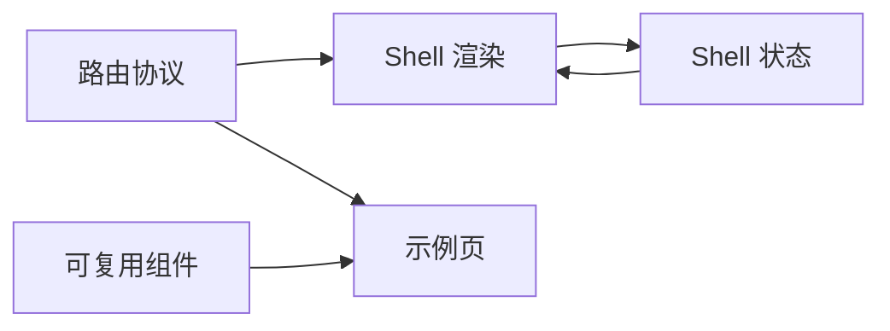

# 架构

本文档是仓库的顶层地图，只回答三件事：系统怎么分层、事实来源在哪里、改动通常应落到哪一层。

## 这个系统是什么？

面向后台场景的前端模板（Vue 3 + TypeScript + Vite）。核心架构选择：shell 行为由显式的 route schema 和共享组件契约驱动，而不是分散在页面组件里。

## 业务领域

业务领域划分独立维护在 `docs/DOMAINS.md`。

## 代码分层模型

**依赖规则：**

- 示例页可依赖路由协议和组件，但不定义 shell 策略
- Shell 运行时只读取 route metadata 和 store，不反向依赖页面
- 可复用组件不依赖 shell 状态或路由实现

## 系统概览

从高层看：

- `src/router/` 定义路由协议、本地 route schema、标准化规则与 Vue Router records
- `src/app/shell/` 与 `src/layouts/` 渲染由 route metadata 选择出的应用壳层
- `src/stores/` 保存设备形态、菜单展开、标签页、keep-alive 缓存等壳层状态
- `src/components/` 提供可复用 UI 基元和更高层的通用组件
- `src/pages/` 承载用于演示模板能力的示例页
- `docs/` 是文档记录系统

## 技术栈

| 层级   | 技术                   | 备注                               |
| ------ | ---------------------- | ---------------------------------- |
| 框架   | Vue 3.5 + TypeScript 6 | Composition API + `<script setup>` |
| 构建   | Vite 7                 | 开发 / 生产                        |
| 状态   | Pinia 3                | UI 与 shell 状态                   |
| 路由   | Vue Router 5           | schema 驱动                        |
| UI 库  | Element Plus           | 基础组件                           |
| 国际化 | Vue I18n 11            | 中英双语                           |
| 测试   | Vitest                 | 单元测试                           |
| 包管理 | pnpm 10                | Node >= 22.14                      |

## 架构原则

1. 路由 schema 与组件契约应尽量显式。
2. 菜单、标签页、缓存、布局选择属于 shell，不属于页面。
3. 共享基元优先于单页临时方案。
4. 关键行为应能被测试保护。

## 仓库分层

### 1. 应用启动层

相关文件：

- `src/main.ts`
- `src/App.vue`
- `src/utils/initApp.ts`
- `src/stores/pinia.ts`
- `src/locales/i18n.ts`

职责：

- 初始化应用设置
- 创建 Vue 应用
- 注册 Pinia、router 和 i18n
- 加载全局样式

启动层应保持小而稳定。

### 2. 路由与壳层协议层

相关文件：

- `src/router/types.ts`
- `src/router/app-route-schema.ts`
- `src/router/route-normalizer.ts`
- `src/router/app-route-tree.ts`
- `src/router/app-routes.ts`
- `src/router/index.ts`

核心思路：

- `AppRouteRecord` 与 `AppRouteMeta` 定义路由协议
- `app-route-schema.ts` 是当前本地路由声明的事实来源
- `route-normalizer.ts` 负责补默认值并统一结构
- `app-routes.ts` 把标准化后的 schema 转成 Vue Router records
- `router/index.ts` 负责在路由切换后同步菜单和标签页状态

边界：

如果某个页面的菜单、标签页、缓存等行为能用 route metadata 表达，就不要在页面组件里各写一套逻辑。

### 3. 壳层渲染层

相关文件：

- `src/app/shell/AppLayoutRenderer.vue`
- `src/app/shell/AppPageRenderer.vue`
- `src/app/shell/layout-registry.ts`
- `src/app/shell/route-cache.ts`
- `src/layouts/DefaultLayout.vue`
- `src/layouts/BlankLayout.vue`
- `src/layouts/components/*`

职责：

- 根据 route metadata 选择正确 layout
- 渲染 header、sider、tabs、页面容器等共享区域
- 避免把 shell 状态编排塞进页面组件
- 集中处理 keep-alive 和页面承载逻辑

这一层负责把 route metadata 变成实际应用外壳。

### 4. 状态层

相关文件：

- `src/stores/app-shell.ts`
- `src/stores/menu.ts`
- `src/stores/tabs.ts`
- `src/stores/keep-alive.ts`

store 边界：

- `app-shell` 负责设备类型、侧边栏折叠和移动端抽屉可见性
- `menu` 负责菜单树、当前激活项与展开祖先节点
- `tabs` 负责打开的页面会话与刷新版本
- `keep-alive` 负责缓存成员和 bust 版本

这些 store 只表达 UI 状态，不承载业务领域模型。

### 5. 可复用 UI 组件层

相关目录：

- `src/components/pro-form/`
- `src/components/pro-table/`
- `src/components/pro-dialog/`
- `src/components/pro-detail/`
- `src/components/search-bar/`
- `src/components/icon/`
- `src/components/field-components/`

原则：

- 优先定义明确契约
- 公共 API 必须在 `docs/components/` 中有文档
- 多组件共享的协议类型应复用，而不是重复定义
- 扩展点优先通过 slot、schema 和类型化配置暴露，而不是隐藏分支

`src/components/` 是模板最有复用价值的产品层。

### 6. 页面与示例层

相关文件：

- `src/pages/index.vue`
- `src/pages/*-demo.vue`

这些页面的作用是：

- 展示组件能力
- 验证壳层组合效果
- 为测试和未来使用者提供更真实的使用场景

这些页面不是长期业务域模型；出现可复用行为时，应优先下沉到共享层。

### 7. 样式层

相关文件：

- `src/assets/scss/main.scss`
- `src/assets/scss/base/*`
- `src/assets/scss/theme/*`

样式策略：

- 全局 token 和 reset 放在 SCSS 中
- shell 级 token 用于保证布局一致性
- 组件样式尽量靠近组件本身
- Element Plus 覆盖样式应集中维护，而不是散落在页面样式中

### 8. 国际化层

相关文件：

- `src/locales/config.ts`
- `src/locales/i18n.ts`
- `src/locales/zh-CN/common.json`
- `src/locales/en-US/common.json`

当前 i18n 层较轻量，主要服务于 shell 文案、通用组件文案与示例内容。

### 9. 质量与测试层

相关文件：

- `eslint.config.js`
- `vitest.config.ts`
- `tests/unit/**`
- `.github/workflows/ci.yml`

质量模型：

- 单元测试保护路由协议、shell store、共享工具与组件逻辑
- E2E 测试已迁移至独立仓库 `bifrost-e2e`
- lint 与 type-check 提供基础正确性约束
- CI 是仓库质量的自动化边界

## 事实来源优先级

修改行为或文档时，建议按下面顺序判断：

1. 运行时代码与测试
2. 路由协议与组件契约文档
3. 架构与设计文档
4. README 与入门文档

如果一次改动影响多个层次，应在一次提交中同步更新。

## 常见修改路径

### 新增一个受 shell 管理的页面

1. 在 `src/router/app-route-schema.ts` 中新增或修改路由项
2. 如果 route metadata 语义不够，更新 `src/router/types.ts` 与标准化逻辑
3. 在 `src/pages/` 中添加页面组件
4. 根据需要补充路由标准化或 shell 同步测试
5. 更新 `docs/product-specs/` 或 `docs/design-docs/` 中的对应说明

### 新增一个可复用组件基元

1. 在 `src/components/` 下创建组件
2. 如有需要，补充共享类型
3. 添加单元测试
4. 在 `docs/components/` 中新增或更新组件文档
5. 如果它改变了模板能力，更新 `docs/FRONTEND.md` 与 `docs/product-specs/`

### 修改布局或导航行为

1. 优先从 route metadata 或 shell store 入手，而不是页面组件
2. 更新 shell 渲染器或 layout 组件
3. 验证 router-shell sync 与 E2E 行为
4. 更新 `ARCHITECTURE.md` 与 `docs/design-docs/route-and-shell-architecture.md`

## 当前边界

- route schema 目前仍然是本地静态声明，尚无服务端驱动路由源
- 示例页既是展示面，也是部分能力验证面，因此还存在一定“示例页 = 验证页”的耦合
- 仓库没有真实后端领域模型或持久化层
- `docs/generated/` 目前较薄，因为仓库尚无数据库 schema 或生成型清单流水线

这些边界是当前阶段有意保留的。
