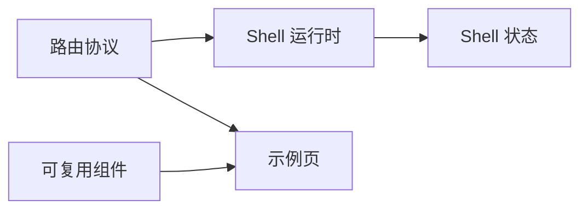

# 业务领域划分

本项目是前端模板，不含真实业务领域。以下按技术职责划分"准领域"，帮助智能体判断代码归属。

## 领域清单

| 领域 | 职责说明 | 代码位置 | 关键实体 |
|------|----------|----------|----------|
| 路由协议 | route schema 定义、标准化、record 生成 | `src/router/` | AppRouteRecord, AppRouteMeta |
| Shell 运行时 | layout 选择、页面承载、keep-alive | `src/app/shell/`, `src/layouts/` | AppLayoutRenderer, AppPageRenderer |
| Shell 状态 | 设备形态、菜单、标签页、缓存 | `src/stores/` | app-shell, menu, tabs, keep-alive |
| 可复用组件 | ProForm, ProTable, ProDialog, ProDetail, SearchBar | `src/components/` | 各组件 props/emits/slots 契约 |
| 示例页 | 组件能力展示与验证 | `src/pages/` | — |
| 国际化 | 多语言文案 | `src/locales/` | — |
| 样式 | 全局 token、reset、主题 | `src/assets/scss/` | — |

## 领域间关系

## 领域通信规则

- 示例页不定义 shell 策略，只消费 route metadata
- 可复用组件不依赖 shell 状态
- Shell 运行时通过 route metadata 驱动，不硬编码页面逻辑
